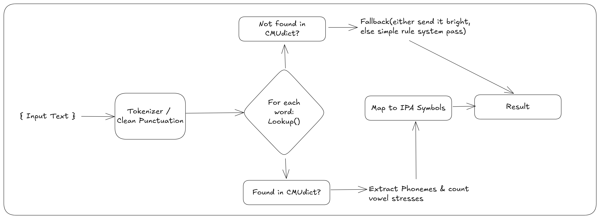

A simple phonetic transcription tool, or international phonetic alphabet converter

**Architecture**


**Status**:
```
(.venv)    ipa-tool   git:(main)  ./ipa_tool.py "I read a book yesterday." -v
./ipa_tool.py "I will read a book tomorrow." -v

=== Context-Aware Phonetic Analysis ===
Original: I read a book yesterday.
IPA:      /aɪ/ /ɹid/ /ʌ/* /bʊk/ /jɛstɜrdeɪ/*.
Syllables: 7

--- Diagnostic Footnotes ---
 * Handled 1 heteronyms natively using syntax rules.
 * Asterisk highlights remaining untreated heteronyms.

=== Context-Aware Phonetic Analysis ===
Original: I will read a book tomorrow.
IPA:      /aɪ/ /wɪl/* /ɹid/ /ʌ/* /bʊk/ /tʌmɑɹoʊ/*.
Syllables: 8

--- Diagnostic Footnotes ---
 * Handled 1 heteronyms natively using syntax rules.
 * Asterisk highlights remaining untreated heteronyms.
```
